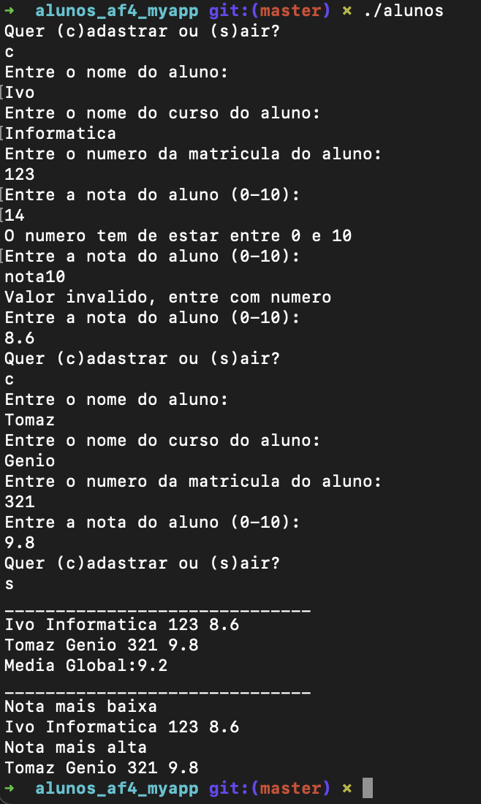

<h1 align="center">
    
</h1>

Trabalho em C++

Programa de alunos em C++, sobre cadastro de alunos, listagem e ordena lista de alunos por matricula

O código apresentado parece ser escrito em C++17 ou posterior, pois utiliza algumas características modernas e boas práticas do C++.

Vamos comentar o código em detalhes:

1. **`le_nota`**:
    - Esta função é utilizada para ler uma nota válida entre 0 e 10, utilizando a entrada do utilizador e tratando possíveis exceções caso a conversão de string para float falhe. Esta é uma abordagem adequada para garantir que a nota inserida seja válida e está dentro do intervalo desejado.
2. **`main`**:
    - Inicia declarando uma variável **`op`** do tipo **`char`**, e uma variável **`lista`** do tipo **`Lista`**.
    - Utiliza um loop infinito **`while(true)`** para permitir cadastrar alunos continuamente até que o utilizador escolha sair.
    - Lê os dados do aluno (nome, curso, matrícula) e utiliza a função **`le_nota`** para ler a nota do aluno, garantindo que seja válida e esteja no intervalo correto.
    - Cria um objeto **`Aluno`** com os dados inseridos e a nota lida e adiciona-o à lista utilizando o método **`adicionar`** da classe **`Lista`**.
    - Em seguida, ordena a lista por matrícula utilizando o método **`ordena`**, e imprime os alunos ordenados utilizando o método **`imprimeAluno`**.
    - Calcula a média global das notas utilizando o método **`calMediaGlobal`** e imprime o resultado.
    - Imprime a nota mais baixa e a nota mais alta utilizando o método **`MaxMin`**.
3. **`Lista`**:
    - Esta classe representa uma lista de alunos. Possui métodos para adicionar alunos, ordenar por matrícula, imprimir alunos, calcular a média global das notas, e obter a nota mais alta e mais baixa.
4. **`Aluno`**:
    - Esta classe representa um aluno. Possui construtor, getters e setters para os atributos **`nome`**, **`curso`**, **`matricula`** e **`nota`**. Além disso, possui um método **`imprime`** que imprime os detalhes do aluno na tela.
    - O operador **`<`** também é sobrecarregado para permitir a ordenação dos alunos por matrícula.

Em geral, o código está escrito seguindo boas práticas do C++17 ou posterior, utilizando recursos modernos e mantendo a legibilidade. A implementação das classes **`Lista`** e **`Aluno`** é uma forma adequada e organizada, permitindo uma fácil manipulação de alunos e suas notas.

📌 Programa de cadastro de alunos em C++
------------------
O projeto foi feito em C++17

The project was done with C++17.

🔧 Tecnologias utilizadas:
------------------

- C++17 e QtCreator 

💬 Fale comigo
------------------
[*Entre em contato comigo*](https://www.linkedin.com/in/ivo-baptista-3712144/)

